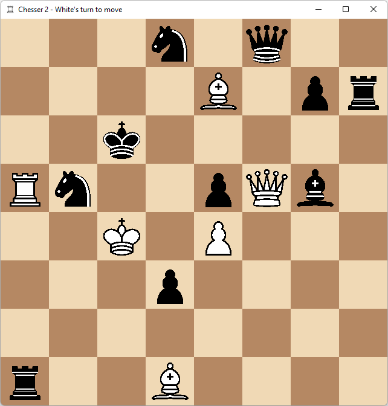

# Chesser 2

Chesser 2 is a simple chess game that I made using `pygame` and the `chess` module.

Run the `game.pyw` file to launch the game. It should take around 2 seconds to start.

Use right shift in-game to change the board [FEN ]([Forsyth–Edwards Notation - Wikipedia](https://en.wikipedia.org/wiki/Forsyth%E2%80%93Edwards_Notation))string.

